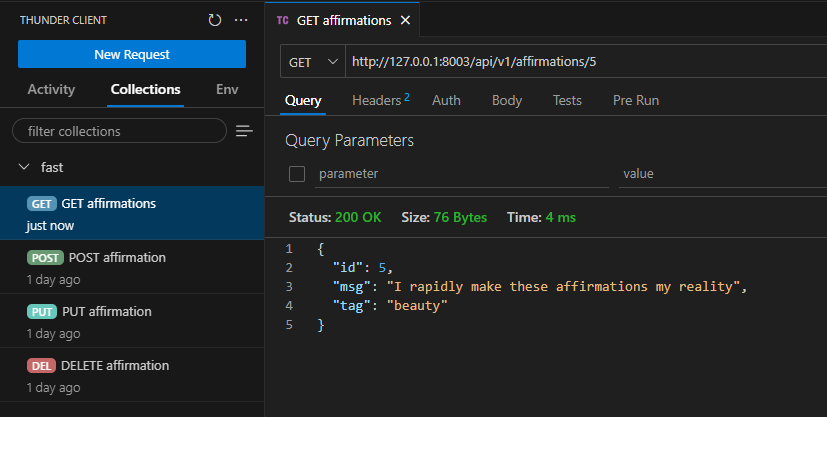
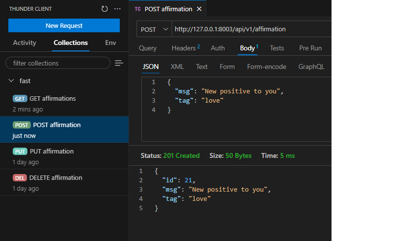
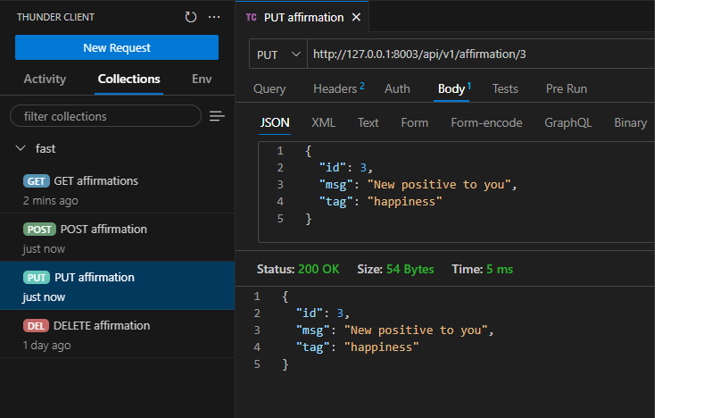
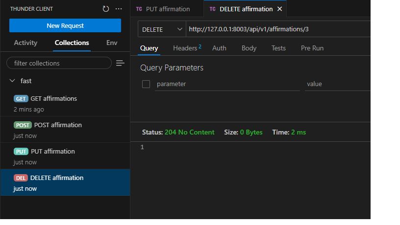

# Positive Affirmations API

## This is an API built as part of my personal portfolio. The idea behind this project is to explore the Fast API framework in a simple but complete way.

### Documentation:
Once you build and run this application in a Docker container, you can find the API documentation at the following links:

http://localhost:8003/docs

http://localhost:8003/redoc

### Requirements:

Docker and Git installed in your local station

### How to build and run:

Firstly, you need to clone this Git repository in your local work directory. You can do this by running the following command in your terminal:

git clone https://github.com/FabricioDE/positiveAffirmationsAPI.git

cd .\positiveAffirmationsAPI\

This application is still in the development stage, so you need to change the local branch with this command:

git checkout develop

Now that you have everything you need, is just build and run the Docker container. You can do this with:

docker build -t positiveapi .

docker run -d -p 8003:8003 positiveapi

By now, your application is already working in a Docker container, and you can reach it using port 8003.

### Testing the API methods.

In the development stage of this project, I'm using the Thunder Client VS Code extension. It's a complete and intuitive extension that helps me test every route I build. Check out the examples below:

#### GET:

#### POST:

#### PUT:

#### DELETE:

